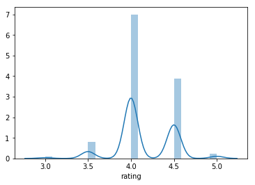

# Yelp Report Cards

Welcome to Yelp Report Cards.  In this project, if is my aim to produce a business value-add to Yelp's current business owner services by attempting to generate a baseline report card for restaurants generated from sentiment analysis using NLTK's Vader Sentiment Analysis and combining it with topic modeling using Genism's LDA library.

## The Business Case

Yelp is quite possibly the largest review site in the world for local businesses, encompassing all forms of small businesses from doctor's offices to cleaning services.  At its core however, Yelp began as a crowd-sourced review site, democratizing the restaurant review process and bringing greater exposure to restaurants all over the world by soliciting user-generated content for the restaurants in its database.

Overtime, the popularity of Yelp as a restaurant information resource has led to the creation of millions of points of data.  This has somewhat diluted the impact of Yelp reviews for a restaurant and led to some discontent from restaurant owners.  Below are 3 of many points that resulted in dissatisfaction with business owners on Yelp.

**1.  Law of Large Numbers**

Due to the sheer volume of reviews, every review that goes into a restaurant ends up stabilizing their rating.  There it stays forever, usually at a 4.  At this point, most restaurants shoot for a 4, and only the truly best manage to get a 4.5.  You can see the distribution in reviews in the below graph.  It is assumed 1 and 2 star restaurants usually end up closing, but I can assure you, my local Chinese take out is open and busy as ever.

**2.  Extreme Volatility**

Yelp being the designated ground for people looking to respond in some way or another leads to a lot of praise, or angry passive aggressive content.  People who use Yelp for the first time or the thousandth time are usually motivated by extreme experiences, either positive or negative, and as such their reviews tend to reflect those experiences, without taking into account the remainder of the dining experience.  

**3. Poor representation**

As described above, due to the focus on a single issue we see a large range of positive and negative reviews that aren't properly reflective of the entire dining experience.  These are not reviews as we have come to commonly expect, noting positives and deficiencies.  As such, many restaurants see a lot of 5 star or 1 star reviews which they feel is unbalanced and affects their total score.

## The Question

Given that we have established some of the issues many restaurants face when it comes to dealing with online reviews, is there a way in which Yelp can add value for these restaurants and provide workable feedback?

Yelp holds millions of user reviews, and using NLP we can take this data and provide comprehensive quantitative metrics for a restaurant without having to spend hours hand sorting reviews.  Using this metric, restaurants can hone in on problems and work to improve their business.

## Step 1:  Gathering Data

Using Yelp's API, I obtained the information and more importantly, the restaurant_id for each restaurant in a given borough.  This provided me with a list of 1000 restaurant_id that I could then use to scrape 5 pages or at least 100 reviews for restaurants that had that many reviews.  Some restaurants scraped did not have 100 reviews, and other restaurants had more than 100 reviews due to 

